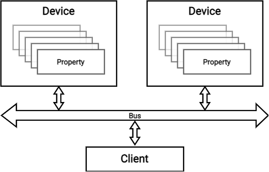

# Devprop specification DRAFT




## Device-property model

The data model is centered around _devices_ which have _properties_. A _client_ can make
_requests_ to devices to get information about the device and its properties, and to get
or set the values of the latter.

A _device_ consists of:
- name
- list of properties

A _property_ consists of:
- name
- data type
- mapping to physical unit: unit, offset, scale
- value range: minimum value, maximum value
- set of permissible operations (READ, WRITE)

The conversion from a raw value to a physical value, in terms of _unit_, is as follows:

```
physical_value = offset + (raw_value * scale)
```
subject to:
```
physical_value >= minimum_value
physical_value <= maximum_value
```

All names should be treated as case-insensitive.

### Naming constraints

The only permissible character groups are alphanumeric characters `A-Z`, `a-z`, `0-9`,
underscore `_` and dot `.`

The name of a device shall be no longer than 32 characters and must begin with a letter.

The name of a property shall be no longer than 64 characters and must begin with a letter or
a dot; however, property names beginning with a dot are reserved for standardized extensions.

Names are treated as case-insensitive.

### Data types

The following data types are recognized:

| Data type | Type code |
|-----------|-----------|
| `uint8`   | `B`       |
| `uint16`  | `H`       |
| `uint32`  | `I`       |
| `int8`    | `b`       |
| `int16`   | `h`       |
| `int32`   | `i`       |


## Manifest format

A _device_ describes itself in a compact way using a _manifest_.

The _manifest_ is an ASCII CSV file without a header row.
Its first row contains a sole value, the name of the device.
Each subsequent row describes one property. None of the columns may contain a comma or a newline
inside its value; thus, no escaping mechanism is necessary.

A property-describing row has the following columns:

| Column        | Expressed as                       | Example            |
|---------------|------------------------------------|--------------------|
| name          | text, subject to constraints above | `Meas.AmbientTemp` |
| type          | _type code_ -- see above           | `B`                |
| physical unit | free-form text, constraints TBD    | `deg C`            |
| offset        | integer or decimal number          | `-10`              |
| scale         | integer or decimal number          | `0.5`              |
| min           | integer or decimal number          | `-10`              |
| max           | integer or decimal number          | `50`               |
| attributes    | one of `r`, `w` or `rw`            | `r`                |

_Property index_ is assigned implicitly in ascending order, starting at index 1
for the first property listed in the manifest (index 0 is reserved).

_Scale_ must not be equal to 0.

_Min_ and _max_ must be consistent with the used data type, offset and scale:
- `min >= offset + type_min * scale`
- `max <= offset + type_max * scale`

where _[type_min; type_max]_ is the inclusive range of the used data type.

_Min_ must be less than _max_.

The _attributes_ column specifies whether the property can be read, written, or both
(the fourth possibility -- a property that can be neither read, nor written -- is _not_ permitted).
All other alphanumeric characters are reserved for future extensions; an unrecognized lowercase
attribute letter may be safely ignored by a client. Uppercase letters and numerals, on the
other hand, are reserved for "critical" attributes; that is, a client will not be able to properly
interpret the property without understanding them.

No two properties can share the same name, or names differing only in letter case (since property
names are case-insensitive).


## Manifest envelope

The manifest envelope starts with a 7-byte header, followed by the manifest body, which may
be compressed. No padding is inserted between the fields.

```
uint8_t[4]  compressed_data_hash
uint16_t    compressed_data_length
uint8_t     version

uint8_t[]   compressed_data
```

`compressed_data_hash` corresponds to the first 4 bytes of an SHA-1 hash of `compressed_data`.

`version` takes one of the following values:

- 0xF0 - DRAFT version, CSV, no compression
- 0xF1 - DRAFT version, CSV, zlib compression


## CAN 2.0B protocol (devprop_can_ext_v1)

### General properties & limits

- 17 bits of message ID required for protocol, 12 bits take a fixed value
- <= 32 devices on the bus
- <= 255 discrete properties per device
- <= 2048 bytes of compressed manifest
- little-endian encoding of multi-byte values
- no proactive announcement of nodes -- bus scan necessary for detection

### Device addressing & message IDs

Message IDs are assigned exclusively from the 29-bit CAN 2.0B identifier space.

The ID is subdivided as follows:

- 8 bits for property index `i`
- 3 bits for operation code `O` (READ MANIFEST, READ PROPERTY, WRITE PROPERTY, ERROR) 
- 5 bits for node ID `n`
- 1 bit for direction `D` (1=request, 0=response)
- 12 bits fixed value `x` (`0xF78`, or `0x1EF00000` when masked out in the full ID)

Visually:
```
msb                          lsb
87654 32109876 54321098 76543210
xxxxx xxxxxxxD nnnnnOOO iiiiiiii
```

### Request-response mechanism

A _transaction_ is always initiated by the _client_, by sending one of the permitted requests:
 - READ MANIFEST
 - READ PROPERTY
 - WRITE PROPERTY

The targeted device shall respond with either a response type matching the request,
or an ERROR response.

### List of requests and responses

#### (0) ERROR

The property index shall match that of the failed request.

Request payload: N/A

Response payload:

```
uint8_t request_opcode
uint8_t error_code
```

#### (1) READ MANIFEST

Read a range of bytes of the manifest. Uniquely for this operation, the property index is
interpreted as an offset in 8-byte blocks. Any attempts to read beyond the end of the manifest
are truncated (the response will be less than 8 bytes or empty).

Request payload: empty

Success response payload:

```
uint8_t[] data
```

If the request payload is non-empty, a PROTOCOL_ERROR should be returned by the device.

#### (2) READ PROPERTY

Get the value of a property. The length and format of the payload depends on the property type.

Request payload: empty

Success response payload:

```
T data
```

If the property does not exist, a BAD_REQUEST should be returned by the device.

#### (3) WRITE PROPERTY

Set the value of a property. The length and format of the payload depends on the property type.

Request payload:

```
T data
```

Success response payload:

```
T data
```

If no value is provided in the request, a PROTOCOL_ERROR should be returned.
If the property does not exist or the value has incorrect size, a BAD_REQUEST should be returned.
If the value is not acceptable (e.g., out-of-bounds), a VALUE_ERROR should be returned.

### List of error codes

- BAD_REQUEST
- GENERIC_ERROR
- INTERNAL_ERROR
- NOT_IMPLEMENTED
- PROTOCOL_ERROR
- VALUE_ERROR


## Appendix (non-normative): conventions

### Property names

Property names should be hierarchical, using a dot (`.`) as separator, and CamelCase for
individual elements. For acronyms, only the first character should be capitalized, to improve
readability. Examples:
- `Meas.Aux.AmbientTemp`
- `Ocp.Threshold.Stw`

### Device names

Device names should be hierarchical, using a dot (`.`) as separator, and using appropriate
case in spelling of individual elements. Examples:
- `FSE10.AMS`
- `CHG`
- `Logger`

### Referring to devices

A device may be referred to by its name:

`FSE10.AMS`

or by a node ID:

`@7`

or both:

`FSE10.AMS@7`

Including the node ID removes any ambiguity in case of multiple devices of the same type on the bus.

### Referring to properties

When referring to a property of a specific device, the names of the two should be joined using a slash (`/`) character:

`FSE10.AMS/Meas.AmbientTemp`

`@7/Meas.AmbientTemp`

`FSE10.AMS@7/Meas.AmbientTemp`

## Appendix (non-normative): rationale

### Client initiated-communication, 1:1 command:response correspondence

- device does not need to remember any protocol-level state
- no timing concerns for device
- simplicity (1 message = 1 transaction)

### Hierarchical naming

- hierarchy almost inevitable in realistic systems
- providing explicit syntax, but no special technical mechanism, achieves reasonable balance in complexity

### No expectation of stable property IDs

- unless incompatible changes in devices are strictly forbidden (undesirable limitation),
  client _always_ needs up-to-date manifest to interpret/encode values correctly
- since a hash is included in the first segment of the manifest, client can cache the
  manifest body

### Plain-text (CSV) manifest

- human readability eases debugging
- no need to choose binary data type for offset/scale/min/max and possibly impose loss of precision
- expected comparable data entropy to theoretical _straightforward binary format_
  - significant proportion of entropy is property names 
  - small integers in fact take up fewer bytes in ASCII than as IEEE 754 float.

### Shifting complexity from devices to clients

- devices are expected to be resource-constrained, while clients will run mainly on PCs
- clients need to be developed and tested only once

### Type codes

The type codes correspond exactly to those in Python's
[_struct_ package](https://docs.python.org/3/library/struct.html#format-characters).

They are short to minimize manifest size.

The set and naming of types was also inspired by that of
[ROS 2](http://docs.ros.org/en/rolling/Concepts/About-ROS-Interfaces.html#field-types).

### List of prior art

- CANopen
- Controls Middleware - Accelerator Device Model
- DataFields (unpublished prototype)

## Appendix (non-normative): examples

TODO

## History of changes

Only changes to normative sections are logged here.

| Date       | Version | Summary of changes                                              |
|------------|---------|-----------------------------------------------------------------|
| 2022-03-12 | DRAFT   | Clarify constraints on naming and property offset/scale/min/max |
| 2022-03-11 | DRAFT   | Add a provision for reserver property attributes                |
| 2022-03-11 | DRAFT   | Add a provision for reserved property names                     |
| 2022-03-09 | DRAFT   | Draft specification                                             |
